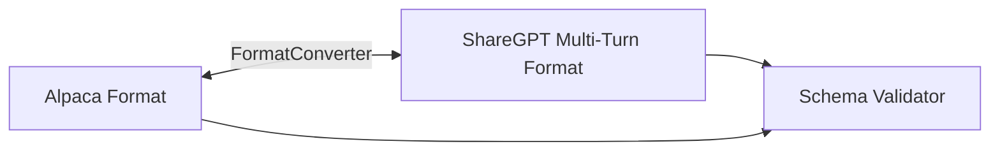

# genpark-alpaca-sharegpt-format-converter-skill

A schema converter and format transformer translating instruction datasets between Alpaca format and ShareGPT multi-turn conversational format.

## Architecture

## Features
- **Lossless Conversion**: Preserves context and inputs seamlessly.
- **Format Validation**: Ensures compliance with fine-tuning standards.
- **Pure Python**: 100% Standard Library.
